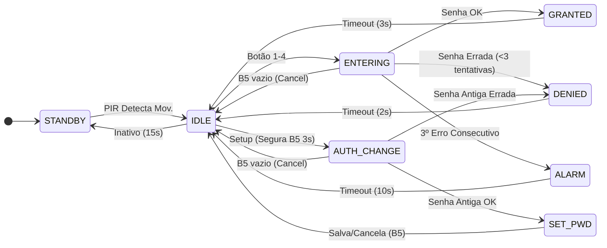

# Processo Seletivo – Intensivo Maker | IoT
## Etapa Prática – Sistemas Embarcados Avançados


# 🔐 Cofre Inteligente IoT com Gestão de Energia e Memória


## 👤 Identificação do Candidato


 - **Nome completo:**  _Jonathas Levi Pascoal Palmeira_ 
- **GitHub:**  _https://github.com/Aqu4tro_ 


---


## 1️⃣ Visão Geral da Solução

## 1️⃣ Visão Geral da Solução

Este projeto implementa um **sistema de controle de acesso avançado** simulado em hardware virtual (ESP32 via Wokwi). 

Embora o escopo principal seja a simulação de um **cofre inteligente**, a arquitetura de firmware desenvolvida aqui é altamente abrangente. Por utilizar uma gestão eficiente de estados, interface humana-máquina (HMI), persistência de dados e conectividade em nuvem, o mesmo código base pode ser facilmente adaptado para outros cenários do mundo real, tais como:
* Fechaduras eletrônicas residenciais ou de hotelaria.
* Painéis de alarme de segurança patrimonial integrados com smartphones.
* Intertravamento de máquinas industriais.

O sistema evoluiu de um simples teclado de senhas para uma solução completa de IoT focada em segurança. Ele aguarda em modo de baixo consumo (Standby) até detectar presença. Ao ser ativado, o usuário interage através de um Display OLED.

**Diferenciais de Segurança:** 

1. **IoT e Alertas em Tempo Real:** Conectado via Wi-Fi, o cofre envia notificações instantâneas com data e hora para o celular do proprietário via **Telegram** sempre que for aberto, bloqueado ou tiver a senha alterada.

2. **Sistema Anti-Reboot:** A quantidade de tentativas erradas, o estado de bloqueio (alarme) e a senha são salvos na memória Flash (`config.json`). Isso impede que um invasor burle o bloqueio de tempo simplesmente tirando o cofre da tomada.

---


## 2️⃣ Arquitetura do Sistema Embarcado

O sistema é governado por uma **Máquina de Estados Finitos (FSM)** puramente não-bloqueante. O loop principal roda continuamente sem uso de atrasos (`time.sleep()`), garantindo multitarefa cooperativa real e responsividade impecável da interface.

### Diagrama de Estados (Renderizado via Mermaid)




### Fluxo do `main.py`
1. Inicializa pinos, barramento I2C, e carrega o estado de segurança e a senha do `config.json` na memória.
2. Conecta à rede Wi-Fi e sincroniza o relógio interno via servidor NTP (horário de Brasília UTC-3).
3. Entra no `while True` do loop principal.
4. Lê o tempo atual (`time.ticks_ms()`) e verifica o sensor PIR e os botões (com debounce e detecção de *long press*).
5. Executa o bloco do estado atual: atualiza o Display OLED, manipula LEDs, Buzzer e envia requisições HTTPS via API do Telegram quando necessário.
6. Chama a função `change_state()` para resetar variáveis de controle na transição de telas.


---


## 3️⃣ Componentes Utilizados na Simulação


```markdown
| Componente | Qtd | Pinos (ESP32) | Função |
|---|---|---|---|
| ESP32 DevKit V1 | 1 | — | Microcontrolador principal (MicroPython) |
| Display OLED SSD1306 | 1 | SDA: 21, SCL: 22 | Interface Visual Humano-Máquina (HMI) via I2C |
| Sensor PIR | 1 | GPIO 15 | Detecção de presença para acordar o sistema |
| LED Verde | 1 | GPIO 2 | Indica acesso liberado |
| LED Vermelho | 1 | GPIO 4 | Indica senha errada ou alarme ativo |
| LED Amarelo | 1 | GPIO 5 | Indica modo de configuração ativo |
| Buzzer Piezo | 1 | GPIO 18 | Feedback sonoro via PWM (bipes e sirene) |
| Botão 1 | 1 | GPIO 13 | Dígito 1 da senha |
| Botão 2 | 1 | GPIO 12 | Dígito 2 da senha |
| Botão 3 | 1 | GPIO 14 | Dígito 3 da senha |
| Botão 4 | 1 | GPIO 27 | Dígito 4 da senha |
| Botão 5 | 1 | GPIO 26 | **NOVO:** Função Backspace (Apagar), Voltar/Cancelar e Configuração de Senha (Long Press) |
```


---


## 4️⃣ Decisões Técnicas Relevantes

* **Driver Local (`ssd1306.py`):** Optou-se por criar/incluir o arquivo `ssd1306.py` diretamente no projeto em vez de depender de gerenciadores de pacotes (como `mip` ou `upip`). Isso garante total portabilidade, assegurando que o código rode perfeitamente offline, em simuladores como o Wokwi, ou em placas físicas recém-formatadas sem depender de conexão com a internet para baixar dependências do display.
* **Persistência de Dados (NVS):** O uso do módulo `json` para ler e gravar a senha no sistema de arquivos Flash simula requisitos reais da indústria para armazenamento não-volátil.
* **Segurança de Configuração (AUTH_CHANGE):** Para impedir que pessoas não autorizadas redefinam a senha, o sistema agora exige a autenticação da senha antiga antes de liberar a gravação de uma nova.
* **UX Melhorada (Backspace / Cancel):** Implementação de um 5º botão com dupla função contextual. Se há dígitos digitados, ele apaga o último caractere. Se o campo está vazio, ele atua como "Cancelar", abortando a operação e voltando ao estado inicial com segurança.
* **Power Management (Standby):** Adição de um estado inicial de economia de energia. A interface só liga quando o sensor PIR detecta movimento.
* **Detecção de Long Press e Prevenção de Bug:** O Botão 5 executa dupla função. Segurar por 3 segundos aciona a rotina de alteração de senha. Foi implementada uma trava de software (loop de espera) para garantir que o sistema não leia a soltura do botão como um cancelamento involuntário logo após mudar de tela.
* **Integração IoT via API do Telegram (`requests`):** Uso da biblioteca moderna `requests` do MicroPython para realizar chamadas HTTPS diretas à API do Telegram, garantindo que o proprietário seja notificado remotamente sem depender de servidores intermediários ou brokers MQTT.
* **Sistema Anti-Reboot (Persistência Avançada):** O módulo `json` não salva apenas a senha, mas também o número de tentativas falhas e o status de bloqueio. Se o alarme disparar e a energia for cortada, o ESP32 voltará ligado diretamente no estado de ALARME, garantindo a integridade do bloqueio.
* **Sincronização de Tempo (NTP):** Implementação da biblioteca `ntptime` para buscar a hora real da internet. O cálculo de fuso horário (-10800 segundos para UTC-3) foi implementado manualmente para garantir timestamps precisos nos logs do Telegram e na tela de economia de energia.

---


## 5️⃣ Como Testar no Simulador (Tutorial)

Para avaliar todas as funcionalidades do protótipo no Wokwi e testar a integração IoT, siga este passo a passo:

> 🔑 **Senha Padrão de Fábrica:** `1 - 3 - 2 - 4`

### Pré-requisito: Configurando as Notificações (Opcional)

Antes de dar "Play" na simulação, **caso queira testar com o Telegram**, você precisará configurar o seu robô mensageiro. Caso nunca tenha feito isso, consulte o [Tutorial Oficial do Telegram](https://core.telegram.org/bots/tutorial) ou siga este resumo prático:
1. No Telegram, busque por **`@BotFather`**, crie um bot enviando o comando `/newbot` e copie o **Token da API**.
2. Busque por **`@userinfobot`** para descobrir o seu **Chat ID** (apenas números).
3. 🚨 **Crucial:** Abra a conversa com o seu novo bot recém-criado e envie **`/start`** para autorizar o recebimento de mensagens.
4. No arquivo `main.py`, cole o seu Token e o seu Chat ID nas variáveis `BOT_TOKEN` e `CHAT_ID`.

*(Nota: Se você não quiser testar as notificações agora, basta rodar o código normalmente. O cofre funcionará perfeitamente e você pode apenas ignorar as mensagens de erro de envio no terminal).*

### Passo a Passo da Simulação

1. **Acordar o Sistema:** O código inicia em modo `STANDBY`. Clique no sensor **PIR** e selecione *"Simulate motion"*. O sistema ligará a tela, conectará no Wi-Fi, sincronizará o relógio na internet e irá para o estado `IDLE`.
2. **Testar o Backspace e Cancelar:** Comece a digitar uma senha. Aperte a tecla **`*` (Asterisco)** para ver o sistema apagar o último dígito tocando um bipe grave. Se quiser abortar a digitação a qualquer momento, aperte a tecla **`#` (Sustenido)** e ele atuará como "Cancelar".
3. **Acesso Bem-sucedido:** Digite a senha correta (Padrão: **1, 3, 2, 4**). O LED verde acenderá com uma mensagem de boas-vindas e **o seu Telegram receberá a notificação:** *"Cofre Aberto em: [Data e Hora]"*.
4. **Alterar a Senha com Segurança:** No modo `IDLE`, **clique e segure a tecla `#` (Sustenido) por cerca de 3 segundos**. 
   * O sistema pedirá a senha antiga (`1-3-2-4`).
   * Se acertar, ele pede a **NOVA SENHA**. Digite 4 botões de sua escolha. A nova senha será persistida na memória Flash e **o Telegram avisará:** *"Senha alterada com sucesso em: [Data e Hora]"*.
5. **Testar o Alarme e Anti-Reboot:** Erre a senha de propósito 3 vezes consecutivas. O LED Vermelho piscará rapidamente, a sirene vai tocar e **o Telegram receberá um:** *"ALERTA: Tentativa de invasão!"*. 
   * *Teste Especial:* Pare a simulação do Wokwi no meio do alarme e dê "Play" novamente. O cofre já vai ligar direto no modo de bloqueio apitando, provando que a memória Anti-Reboot funciona!

---


## 6️⃣ Resultados Obtidos

O sistema roda perfeitamente de forma responsiva, com a FSM gerenciando o hardware e as requisições de rede sem travar a interface.

- **STANDBY:** Tela exibe "MODO ECONOMIA" e a hora atualizada, aguardando o PIR.
- **IDLE / ENTERING:** OLED exibe asteriscos `*` à medida que a senha é digitada.
- **SET_PWD:** LED amarelo acende, indicando gravação de nova senha. Ao confirmar, envia notificação no celular e salva na Flash.
- **Sucesso:** Tela exibe "ACESSO OK", LED verde acende, zera as tentativas na memória e dispara uma notificação via Telegram: *"Cofre Aberto em: DD/MM/AAAA HH:MM:SS"*.
- **Alarme:** Após 3 erros, a tela exibe alerta, grava o bloqueio na Flash, LED vermelho pisca e o Buzzer simula uma sirene. O proprietário recebe imediatamente o alerta no smartphone.


---


## 7️⃣ Demonstração Visual

*(Abaixo estão os registros do funcionamento do projeto testando todos os casos de uso)*

### 📸 Circuito Montado


### ✅ Teste de Sucesso (Acesso Liberado)
[Gravação de tela de 2026-04-27 02-21-00.webm](https://github.com/user-attachments/assets/74a3f0cc-6340-4a2e-82e3-6ba0e422fb69)


### ❌ Teste de Falha (Alarme Disparado)
[Gravação de tela de 2026-04-27 02-21-43.webm](https://github.com/user-attachments/assets/54d15568-ede4-4bd9-be4a-445d807640e9)


### 🚨 Teste de Alarme (3 Erros e Bipe Contínuo)
[Gravação de tela de 2026-04-27 02-22-08.webm](https://github.com/user-attachments/assets/785e6b1c-3e2a-4974-a448-7bfe60413ed4)


### 🔄 Teste de Troca de Senha (Autenticação e Gravação NVS)
[Gravação de tela de 2026-04-27 02-22-44.webm](https://github.com/user-attachments/assets/35ee330b-0c0c-4517-855f-7051c65115d2)


---


## 8️⃣ Comentários Adicionais

### Limitações e Melhorias Futuras
- **Criptografia:** Atualmente o `config.json` salva a senha e os estados em texto plano. Em produção, seria necessário aplicar um *hash* (como SHA-256) na senha antes de armazená-la na Flash, garantindo que nem mesmo quem tenha acesso físico ao chip consiga ler o código.
- **Backup de Bateria (RTC e UPS):** Adicionar um módulo RTC (Real Time Clock) físico como o DS3231 e um sistema de bateria Lipo para manter o sistema online e disparando alertas no Telegram mesmo em caso de corte de energia da rede principal.

### Aprendizados
O grande salto deste projeto foi transformar um sistema de hardware local em uma aplicação de **Internet das Coisas (IoT)** real. Integrar múltiplos protocolos (I2C para tela, PWM para áudio e Digital IO para sensores) enquanto se mantém a estabilidade de requisições HTTPS na nuvem, sem bloquear o processador do microcontrolador, elevou o projeto de um nível "Maker" para "Embedded Software Engineer".

****
