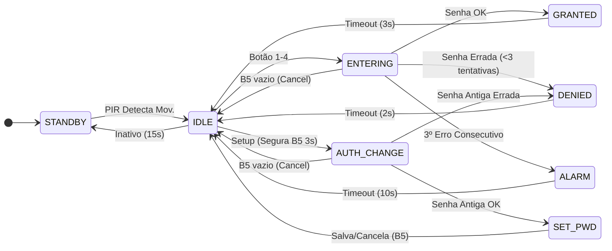
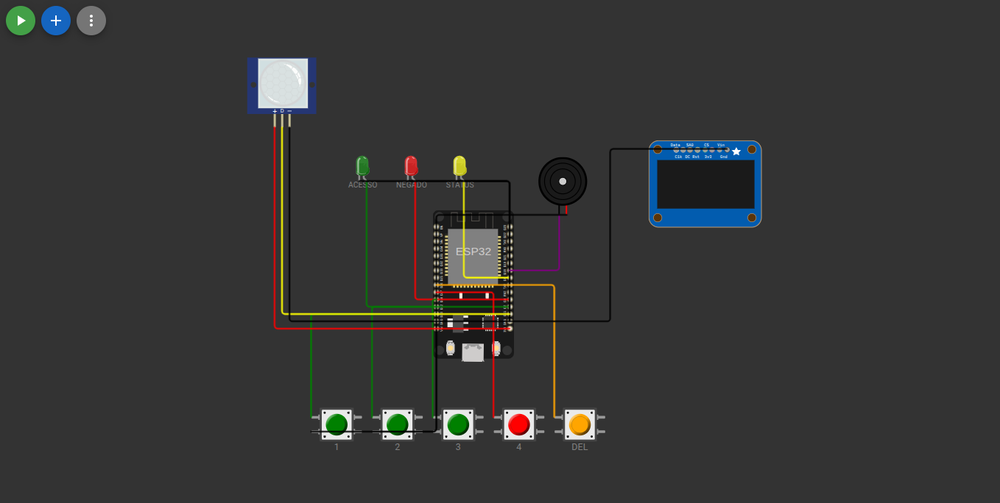

# Processo Seletivo – Intensivo Maker | IoT
## Etapa Prática – Sistemas Embarcados Avançados


# 🔐 Cofre Inteligente IoT com Gestão de Energia e Memória


## 👤 Identificação do Candidato


 - **Nome completo:**  _Jonathas Levi Pascoal Palmeira_ 
- **GitHub:**  _https://github.com/Aqu4tro_ 


---


## 1️⃣ Visão Geral da Solução

Este projeto implementa um **sistema de controle de acesso avançado** simulado em hardware virtual (ESP32 via Wokwi). 

Embora o escopo principal seja a simulação de um **cofre inteligente**, a arquitetura de firmware desenvolvida aqui é altamente abrangente. Por utilizar uma gestão eficiente de estados, interface humana-máquina (HMI) e persistência de dados, o mesmo código base pode ser facilmente adaptado para outros cenários do mundo real, tais como:
* Fechaduras eletrônicas residenciais ou de hotelaria.
* Painéis de alarme de segurança patrimonial.
* Intertravamento de máquinas industriais (exigindo senha de operador para ligar).

O sistema evoluiu de um simples teclado de senhas para uma solução completa de IoT focada em eficiência. Ele aguarda em modo de baixo consumo (Standby) até detectar presença. Ao ser ativado, o usuário interage através de um Display OLED e insere a senha. Se correta, o acesso é liberado; em caso de múltiplas falhas, um alarme é disparado.

**Diferencial:** A senha configurada pelo usuário é salva na memória Flash do microcontrolador, sobrevivendo a reinicializações (quedas de energia).

---


## 2️⃣ Arquitetura do Sistema Embarcado

O sistema é governado por uma **Máquina de Estados Finitos (FSM)** puramente não-bloqueante. O loop principal roda continuamente sem uso de atrasos (`time.sleep()`), garantindo multitarefa cooperativa real e responsividade impecável da interface.

### Diagrama de Estados (Renderizado via Mermaid)

### Diagrama de Estados (Renderizado via Mermaid)




### Fluxo do `main.py`
1. Inicializa pinos, barramento I2C, e tenta ler o `config.json` na memória.
2. Entra no `while True` do loop principal.
3. Lê o tempo atual (`time.ticks_ms()`) e verifica o sensor PIR e os botões (com debounce e detecção de *long press*).
4. Executa o bloco do estado atual: atualiza o Display OLED, manipula os LEDs e o PWM do Buzzer.
5. Chama a função `mudar_estado()` para resetar variáveis de controle na transição de estados.


---


## 3️⃣ Componentes Utilizados na Simulação


```markdown
| Componente | Qtd | Pinos (ESP32) | Função |
|---|---|---|---|
| ESP32 DevKit V1 | 1 | — | Microcontrolador principal (MicroPython) |
| Display OLED SSD1306 | 1 | SDA: 21, SCL: 22 | Interface Visual Humano-Máquina (HMI) via I2C |
| Sensor PIR | 1 | GPIO 15 | Detecção de presença para acordar o sistema |
| LED Verde | 1 | GPIO 2 | Indica acesso liberado |
| LED Vermelho | 1 | GPIO 4 | Indica senha errada ou alarme ativo |
| LED Amarelo | 1 | GPIO 5 | Indica modo de configuração ativo |
| Buzzer Piezo | 1 | GPIO 18 | Feedback sonoro via PWM (bipes e sirene) |
| Botão 1 | 1 | GPIO 13 | Dígito 1 da senha |
| Botão 2 | 1 | GPIO 12 | Dígito 2 da senha |
| Botão 3 | 1 | GPIO 14 | Dígito 3 da senha |
| Botão 4 | 1 | GPIO 27 | Dígito 4 da senha |
| Botão 5 | 1 | GPIO 26 | **NOVO:** Função Backspace (Apagar), Voltar/Cancelar e Configuração de Senha (Long Press) |
```


---


## 4️⃣ Decisões Técnicas Relevantes

* **Driver Local (`ssd1306.py`):** Optou-se por criar/incluir o arquivo `ssd1306.py` diretamente no projeto em vez de depender de gerenciadores de pacotes (como `mip` ou `upip`). Isso garante total portabilidade, assegurando que o código rode perfeitamente offline, em simuladores como o Wokwi, ou em placas físicas recém-formatadas sem depender de conexão com a internet para baixar dependências do display.
* **Persistência de Dados (NVS):** O uso do módulo `json` para ler e gravar a senha no sistema de arquivos Flash simula requisitos reais da indústria para armazenamento não-volátil.
* **Segurança de Configuração (AUTH_CHANGE):** Para impedir que pessoas não autorizadas redefinam a senha, o sistema agora exige a autenticação da senha antiga antes de liberar a gravação de uma nova.
* **UX Melhorada (Backspace / Cancel):** Implementação de um 5º botão com dupla função contextual. Se há dígitos digitados, ele apaga o último caractere. Se o campo está vazio, ele atua como "Cancelar", abortando a operação e voltando ao estado inicial com segurança.
* **Power Management (Standby):** Adição de um estado inicial de economia de energia. A interface só liga quando o sensor PIR detecta movimento.
* **Detecção de Long Press e Prevenção de Bug:** O Botão 5 executa dupla função. Segurar por 3 segundos aciona a rotina de alteração de senha. Foi implementada uma trava de software (loop de espera) para garantir que o sistema não leia a soltura do botão como um cancelamento involuntário logo após mudar de tela.

---


## 5️⃣ Como Testar no Simulador (Tutorial)

Para avaliar todas as funcionalidades do protótipo no Wokwi, siga este passo a passo:

> 🔑 **Senha Padrão de Fábrica:** `1 - 3 - 2 - 4`

1. **Acordar o Sistema:** O código inicia em modo `STANDBY`. Clique no sensor **PIR** e selecione *"Simulate motion"* para o sistema ligar a tela e ir para o estado `IDLE`.
2. **Testar o Backspace (Botão 5):** Comece a digitar uma senha. Aperte o **Botão 5** para ver o sistema apagar o último dígito tocando um bipe grave. Se você apertar o Botão 5 com a tela vazia, ele cancela a ação.
3. **Acesso Bem-sucedido:** Digite a senha padrão correta: **B1, B3, B2, B4**. O LED verde acenderá com uma mensagem de boas-vindas e um bipe de sucesso será emitido.
4. **Alterar a Senha com Segurança:** No modo `IDLE`, **clique e segure o Botão 5 por cerca de 3 segundos**. 
   * *O sistema pedirá a senha antiga primeiro.* Digite `1-3-2-4`.
   * *Se acertar*, o LED Amarelo pisca com um bipe e ele pede a **NOVA SENHA**. Digite 4 botões de sua escolha. A nova senha será persistida na memória flash e o sistema confirmará o sucesso!
5. **Testar o Alarme:** Erre a senha de propósito 3 vezes consecutivas. O LED Vermelho piscará rapidamente, a tela exibirá a mensagem de bloqueio e o Buzzer emitirá um som de sirene contínua, bloqueando o sistema temporariamente por 10 segundos.

---


## 6️⃣ Resultados Obtidos


O sistema roda perfeitamente sem gargalos.


- **STANDBY:** Tela exibe "MODO ECONOMIA", aguardando o PIR.
- **IDLE / ENTERING:** OLED exibe asteriscos `*` à medida que a senha é digitada.
- **SET_PWD:** LED amarelo acende, indicando gravação de nova senha.
- **Sucesso:** Tela exibe "ACESSO OK", LED verde acende, e som de liberação toca.
- **Alarme:** Após 3 erros, a tela exibe alerta, LED vermelho pisca rapidamente e o Buzzer alterna frequências simulando uma sirene de polícia.


---


## 7️⃣ Demonstração Visual

*(Abaixo estão os registros do funcionamento do projeto testando todos os casos de uso)*

### 📸 Circuito Montado


### ✅ Teste de Sucesso (Acesso Liberado)
<video src="assets/acerto_de_senha.webm" controls width="100%"></video>

### ❌ Teste de Falha (Alarme Disparado)
<video src="assets/erro_de_senha.webm" controls width="100%"></video>


### 🚨 Teste de Alarme (3 Erros e Bipe Contínuo)
<video src="assets/erro_triplo_de_senha_bloqueio.webm" controls width="100%"></video>

### 🔄 Teste de Troca de Senha (Autenticação e Gravação NVS)
<video src="assets/redefinir_senha.webm" controls width="100%"></video>

---


## 8️⃣ Comentários Adicionais


### Limitações e Melhorias Futuras
- **Wi-Fi e MQTT:** Como próximo passo lógico para um sistema ESP32, planejo integrar o protocolo MQTT para enviar alertas em tempo real ("Invasão Detectada" ou "Cofre Aberto") para um *broker* na nuvem.
- **Criptografia:** Atualmente o `config.json` salva a senha em texto plano. Em produção, seria necessário aplicar um *hash* (como SHA-256) antes de armazenar os dados na Flash.


### Aprendizados
O grande salto deste projeto foi integrar múltiplos protocolos (I2C para tela, PWM para áudio e Digital IO para sensores) mantendo a estabilidade da FSM sem o uso do bloqueio do processador, elevando o projeto de um nível "Maker" para "Embedded Software Engineer".
****